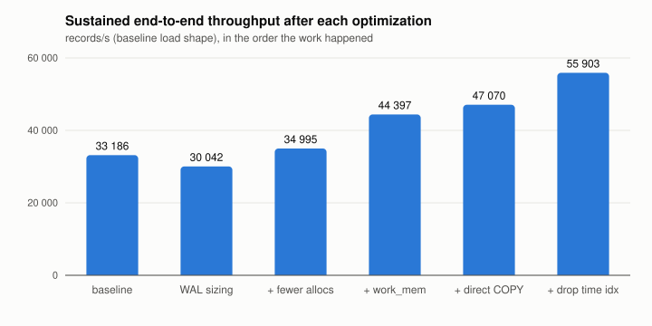
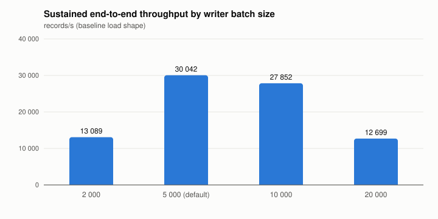
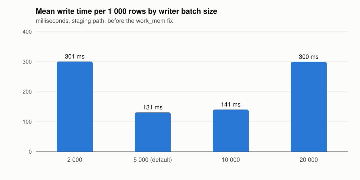

# Benchmarks

Measured numbers for the ingest path, the method that produced them, and the
optimization log: what was changed, what it was expected to do, and what it
measurably did. Everything a number depends on is committed next to it, so a
reader can check the claim rather than trust it.

Raw `.pprof` files are deliberately **not** committed. A profile is only
interpretable with the exact binary that produced it, and four profiles per run
across a dozen runs turns a clone into a download. The rendered flame graphs and
the `pprof -top` text are committed instead; if a raw profile ever needs to
survive, it is attached to the pull request.

## How a run works

One run is one invocation of `deploy/bench.sh` (`make bench-run NAME=...`), and
one run produces one directory under [`runs/`](runs/). The script fixes the
method so every run is comparable to every other:

1. **Fresh collector.** The collector container is recreated, so counters, heap
   and stream cache start from zero and the run's environment is exactly what
   `deploy/docker-compose.bench.yml` passes through. The observability overlay is
   not applied: trace export is work done for someone else.
2. **Clean table, warm process.** `logs` is truncated, then 50 000 records are
   sent unpaced and allowed to drain, so connection pools, staging tables and
   the first chunk exist before the clock starts.
3. **The run.** `loadgen` sends the stated shape. Throughput is what loadgen
   reports: accepted records over wall time, measured at the client.
4. **The drain.** The harness then waits until the row count in TimescaleDB has
   grown by the accepted count. That wait is how far behind the writer was when
   the client finished, which is the end-to-end figure the client cannot see.

Numbers and profiles come from **separate runs**. Profiling (a CPU sample plus
block and mutex sampling in the runtime) costs throughput, so a `PROFILE=1` run
is for reading flame graphs and a `PROFILE=0` run is for reading numbers.

### The baseline load shape

Unless a run says otherwise it sends **3 000 000 records** of **200 bytes** in
**batches of 500** across **64 streams** on **4 concurrent gRPC streams**,
unpaced, from the host to a single collector. Messages are drawn from a fixed
vocabulary with a Zipf word distribution, deterministic in the sequence number,
so two runs put the same bytes on the wire.

### What a run directory holds

| File | What it is |
|------|------------|
| `run.json` | Everything: hardware, commit, collector environment, the loadgen summary, end-to-end drain, and the writer's own counters (rows, retries, mean write time, mean batch size) |
| `loadgen.txt`, `loadgen.json` | The client's view: accepted/rejected, records per second, ack latency p50/p95/p99 |
| `metrics-before.txt`, `metrics-after.txt` | The collector's `/metrics`, filtered to `logagg_`, either side of the run |
| `cpu.svg`, `alloc.svg`, `heap.svg`, `block.svg`, `mutex.svg` | Flame graphs (profiled runs only). CPU covers the first 20 s of the run; the others are cumulative since the collector started |
| `*-top.txt` | `pprof -top` for the same profiles, for reading without a browser |

### Reading the two throughput numbers

- **Client records/s** (`loadgen.records_per_sec`) is how fast the collector
  *accepted* records. Acceptance means the batch was validated and published to
  JetStream. It is bounded by the ingest path and the broker.
- **Sustained records/s** (`end_to_end.sustained_records_per_sec`) is accepted
  records over client time *plus* drain. It is bounded by the writer and the
  database, and it is the number that matters when the client is faster than
  the writer, because the difference is queue growth.

Ack latency is send-to-ack at the client: ingest plus JetStream publish, not
the database write. On an unpaced run it mostly measures queueing in gRPC flow
control; use `RATE=` and `DURATION=` for a latency measurement.

## Hardware baseline

Every run records its own hardware in `run.json`. The numbers in this document
were measured on:

| | |
|---|---|
| Machine | Apple M2 Pro, 10 cores, 16 GiB |
| OS | macOS 26.6.2 |
| Docker | Docker Desktop 29.4.3, Linux VM with 10 CPUs and 7.65 GiB |
| Database | `timescale/timescaledb:2.22.1-pg17`, image defaults (`timescaledb-tune` at first boot), data on a Docker volume |
| Broker | `nats:2.12-alpine`, JetStream file storage on a Docker volume |
| Go | 1.27.1, `linux/arm64` binary in a distroless image |
| Client | `loadgen` on the host, over the published loopback port |

Two caveats that anyone comparing against these numbers should know. The
collector, the database and the broker share one VM, and the client shares the
host with them, so this measures the whole stack on one laptop rather than any
component in isolation. And Docker Desktop's disk is virtualized, so anything
fsync-bound (the database commit, JetStream's file store) is slower here than on
bare metal. Ratios between runs are the point; the absolute figures are a floor.

## Results at a glance

All figures from the baseline load shape on the hardware above. "Sustained" is
accepted records over client time plus drain, the number the database actually
absorbed. Single runs unless a range is given; see [Noise](#noise) before reading
any difference under about 20% as real.

| State | Client rec/s | Sustained rec/s | Drain (s) | Ack p99 (ms) | Mean write per 5 000-row batch (ms) | Run |
|---|---|---|---|---|---|---|
| Baseline (phase 7 code, image defaults) | 65 374 / 64 083 | 33 186 / 27 133 | 44.5 / 63.8 | 1 380 / 1 100 | 588 / 726 | `baseline`, `baseline-2` |
| 1. `max_wal_size` 1 GB → 4 GB | 102 568 | 30 042 | 70.6 | 903 | 654 | `wal-4g` |
| 2. Fewer allocations (−37% bytes) | 52 059 | 34 995 | 28.1 | 4 552 | 564 | `alloc` |
| 3. `SET LOCAL work_mem` in the staging insert | 91 569 / 62 786 / 70 699 | 44 397 / 36 200 / 34 817 | 34.8 / 35.1 / 43.7 | 1 563 / 5 358 / 2 015 | 437 / 552 / 562 | `staging-workmem`, `-2`, `-3` |
| 4. Direct `COPY` with staging fallback | 90 267 / 62 739 / 118 349 | 47 070 / 32 031 / 50 883 | 30.5 / 45.8 / 33.6 | 985 / 2 916 / 691 | 390 / 555 / 385 | `direct`, `-2`, `-3` |
| 5. Drop the default `time` index | 183 553 | **55 903** | 37.3 | 496 | 357 | `direct-noidx` |



The writer is the bottleneck throughout: the client can push 90–120k records/s
into JetStream, and the database absorbs 30–50k/s. Every entry below is about
that gap.

## Noise

Two identical baseline runs differed by 20% in sustained throughput (33k vs 27k)
and 40% in drain. Three runs each of states 3 and 4 spread by about 25%. The
cause is the disk: Postgres, JetStream and the page cache share one virtualized
Docker Desktop volume, and any burst of writeback (a checkpoint, JetStream
compacting its store) stalls everything else for seconds. The ack p99 column is
the tell: a p99 over ~2 s means JetStream publishes were stalling during the run,
and the client figure is depressed for a reason that has nothing to do with the
change under test. Read sustained throughput and mean write time, prefer the
median of repeated runs, and treat single-run deltas under 20% as unproven.

Two environmental effects were large enough to invalidate runs outright, and the
harness now records both in `run.json`:

- **Neighbouring containers.** The first baseline attempt ran with another
  project's stack (about 3 GiB) in the same 7.65 GiB VM. Swap was fully used, the
  client rate collapsed from 183k to 34k records/s and publishes timed out. Every
  run in this document was taken with nothing else running
  (`hardware.other_containers_running`, `docker_vm_swap_used_mb`).
- **Postgres crash recovery.** Recreating the database container with a 10 s stop
  grace period SIGKILLs Postgres mid-checkpoint; the next start replays WAL for a
  minute or more, during which the healthcheck fails. `stop_grace_period: 60s` in
  `deploy/docker-compose.yml` is the fix, and the harness retries a database that
  is still recovering.

## Where the time went (baseline profiles)

`runs/baseline-profiled/` holds the flame graphs. The collector process itself
was **not** the bottleneck: 864 CPU samples in a 20 s window is 0.43 of one core,
while Postgres ran at 380% CPU and the disk was saturated. What the profiles did
say, and what became entries 2–4:

- **CPU** (`cpu.svg`): 26% `memclrNoHeapPointers`, 13% `memmove`, 10%
  `spanInlineMarkBits.init` — the runtime zeroing and scanning large, short-lived
  allocations. Protobuf decoding (`unmarshalPointerEager`, 26% cumulative) is the
  largest piece of real work.
- **Allocations** (`alloc.svg`, 4.34 GB for 3M records, ~1.4 KB per 250-byte
  record): protobuf string decoding 26%, protobuf message structs 19%,
  **re-marshaling the batch for JetStream 15%**, the NATS client's read buffers
  14%, **`copyRow`'s boxed `[]any` per row 9%**, **the consumer's per-message
  record slice 7%**. The bold ones are ours.
- **Mutex** (`mutex.svg`, 101 s of contention): 83% in `runtime.unlock`, i.e.
  the allocator's heap lock, reached from the ingest handler. Allocation pressure
  again, not a lock in this code.
- **Block** (`block.svg`): idle waits in `selectgo` and memberlist timers; the
  only real one is `pgx.CopyFrom` waiting on the database, which is the point.
- **Heap in use** (`heap.svg`, 409 MB): 61% is decoded-but-unwritten batches held
  by the JetStream pull consumer. `LOGAGG_QUEUE_MAX_ACK_PENDING` (4096) times the
  ~110 KB message size bounds the collector's memory, and at this load shape that
  bound is ~450 MB, which is what `docker stats` showed (840 MiB RSS). Not changed
  here; noted as the knob that sizes the process.

## Optimization log

Each entry states the change, the hypothesis, the runs that test it, and the
delta. Entries are in the order the work happened, including the ones that did
not pay off. Later entries are measured against the state the previous one left.

### 1. Checkpoints: `max_wal_size` 1 GB → 4 GB, `checkpoint_timeout` 15 min

**Change.** Two Postgres server flags, passed as `command` arguments to the
`timescaledb` service in `deploy/docker-compose.yml`. The image's
`timescaledb-tune` leaves `max_wal_size` at 1 GB.

**Hypothesis.** The baseline wrote **5.7 GB of WAL for 1.2 GB of table** and ran
11 WAL-triggered checkpoints in 90 s, each taking 60–190 s to write out with
`checkpoint_completion_target = 0.9`, so the checkpointer never stopped. Every
checkpoint re-arms full-page writes, so the same index pages were written to WAL
as full images over and over. And the disk that absorbed those writes is also
JetStream's disk: the NATS log showed `Readloop processing time: 5.8s` and
internal-API stalls of up to 28 s, which surfaced as 5 s publish timeouts and
`ACK_CODE_INTERNAL` acks to the client. Fewer checkpoints should mean less WAL,
less writeback, and no JetStream stalls.

**Runs.** `runs/baseline` against `runs/wal-4g`.

| | before | after |
|---|---|---|
| WAL written for 3.05M rows | 5.7 GB | 1.8 GB |
| Full-page images | (dominant) | 138 |
| Checkpoints during the run | 11 (all WAL-triggered) | 1 |
| Publish timeouts (`ACK_CODE_INTERNAL`) | 0–8 per run | 0 |
| Client rec/s | 65 374 | **102 568** |
| Sustained rec/s | 33 186 | 30 042 |
| Mean write (ms) | 588 | 654 |

**Result.** WAL volume fell 3×, the ingest side stopped stalling and the client
rate rose 57%, but **the writer did not get faster**: the per-batch write was
Postgres CPU (index maintenance and the staging insert), not I/O. Kept, because
it removed the failure mode rather than for throughput. Cost: a larger
`max_wal_size` lengthens crash recovery, which is the reason for the grace-period
fix above. `wal_compression = lz4` was also tried (`runs/wal4g-lz4`): with only
138 full-page images left it had nothing to compress, WAL stayed at 1.8 GB and
the run was slower. Rejected.

### 2. Allocation reduction, driven by the alloc profile

**Change.** Three sites, each the top of a flame:

- `storage.copyRow` reuses one `[8]any` per COPY and hands pgx pointers into the
  record instead of boxed values (`time.Time`, `int64`, `string` all allocate when
  put in an interface). pgx encodes each row before requesting the next, so the
  reuse is safe.
- The consumer's per-message `[]model.LogRecord` comes from a `sync.Pool`
  (`storage.NewRecords`) and goes back once the writer has copied it into its
  batch. Cleared on return so the pool holds no strings alive.
- The ingest handler marshals the outgoing JetStream payload into a pooled buffer
  (`proto.MarshalOptions.MarshalAppend`) and returns it after both publishes,
  which copy the bytes into their connection buffers before returning.

**Hypothesis.** Those three were 31% of allocated bytes; less allocation means
less zeroing, fewer GC cycles and less heap-lock contention, all of which the CPU
and mutex profiles named.

**Runs.** `runs/baseline-profiled` against `runs/alloc-profiled` (profiles);
`runs/wal-4g` against `runs/alloc` (throughput).

| | before | after |
|---|---|---|
| Bytes allocated for 3M records | 4.34 GB | **2.72 GB** (−37%) |
| `copyRow`, marshal, record slice in the alloc top | 388 + 641 + 321 MB | gone |
| Mutex contention (20 s window) | 101 s | **25 s** |
| CPU per record accepted (from the 20 s sample) | ~10.7 µs | ~9.0 µs |
| Sustained rec/s | 30 042 | 34 995 |
| Mean write (ms) | 654 | 564 |

**Result.** The collector does the same work with 37% fewer bytes allocated and
a quarter of the lock contention. Throughput moved 16%, which is inside the noise
band; that was expected, since the collector was using under half a core. Kept:
the win is CPU headroom per node, which is what a horizontally scaled collector
pays for.

### 3. The staging insert's sort was spilling to disk

**Change.** `SET LOCAL work_mem = '64MB'` at the top of the staging transaction.

**Hypothesis.** The batch-size sweep (below) made no sense: 20 000-row batches
cost 8× a 5 000-row batch, not 4×. `pg_stat_database` explained it: **465 temp
files, 1.56 GB**, in a sweep. The staging path's `INSERT … SELECT … ORDER BY
stream_id, seq, time` sorts every batch, and the image's `work_mem` is 2 MB,
which holds about 7 000 rows of 200-byte messages. Anything larger sorted on the
disk everything else was waiting for.

**Runs.** `runs/alloc` against `runs/staging-workmem` (5 000-row batches);
`runs/wal4g-batch-20000` against `runs/staging-workmem-20000` (20 000-row).

| | before | after |
|---|---|---|
| Mean write, 5 000-row batch (ms) | 564 | **437** |
| Mean write, 20 000-row batch (ms) | 5 466 | **1 784** |
| Sustained rec/s, 5 000 | 34 995 | 44 397 |
| Sustained rec/s, 20 000 | 12 699 | 42 216 |
| Temp files during a run | hundreds | 3 |

**Result.** A one-line fix worth 25% on the default batch and 3× on large ones,
and it made the batch-size curve flat, which is the honest answer to "what batch
size": above 5 000 it no longer matters. Kept.

### 4. `COPY` straight into the hypertable, staging only on a replay

**Change.** `LOGAGG_WRITER_COPY_MODE=direct` (now the default). The writer COPYs
into `logs` directly; if a redelivered record trips the dedup index (SQLSTATE
23505) the batch is redone through the staging path, and
`logagg_storage_direct_copy_fallbacks_total` counts it. Each batch is sorted by
the dedup key before either path, which preserves the cluster-wide lock order the
staging `ORDER BY` used to provide. The trade-off the schema deferred, now with
numbers.

**Hypothesis.** Staging costs a second pass over every row (temp-table write,
sort, `ON CONFLICT` probe of the unique index per row) that at-least-once
delivery only needs on the rare replay. Direct COPY also WAL-logs heap inserts as
multi-row records rather than one per row.

**Runs.** Three each, alternating, on the same build:
`runs/staging-workmem{,-2,-3}` against `runs/direct{,-2,-3}`.

| | staging + work_mem | direct |
|---|---|---|
| Sustained rec/s (three runs) | 44 397 / 36 200 / 34 817 | 47 070 / 32 031 / 50 883 |
| Sustained rec/s, median | 36 200 | **47 070** |
| Mean write (ms), three runs | 437 / 552 / 562 | 390 / 555 / 385 |
| Mean write (ms), median | 552 | **390** |
| Fallbacks | — | 0 |
| Integration tests with a full and a partial replay | pass | pass |

**Result.** About 1.3× the writer throughput in the median, with one run of
three in the noise band. Adopted as the default; `staging` stays selectable for a
deployment where replays are the norm, because a replayed batch on the direct
path pays for both.

### 5. Storage: the default `time` index, compression, chunk sizing

**Change.** Migration 0004 drops `logs_time_idx`, the `(time DESC)` index that
`create_hypertable` makes by default. 0001 already created `logs_time_level` on
`(time DESC, level)`, whose leading column serves every time-ordered scan the
default index served, so the hypertable carried two copies of the same ordering:
three B-trees per chunk (dedup 210 MB, time_level 130 MB, time 89 MB for 3M
rows) where two do the work.

**Hypothesis.** One fewer index to maintain per inserted row, and one fewer to
fit in cache.

**Runs.** `runs/direct` (median of three) against `runs/direct-noidx`.

| | before | after |
|---|---|---|
| Mean write (ms) | 390 | **357** |
| Sustained rec/s | 47 070 | **55 903** |
| Index bytes per 3M rows | 429 MB | 340 MB |
| Plans for `ORDER BY time DESC LIMIT n` | Index Scan on `logs_time_idx` | Index Scan on `logs_time_level` |

**Result.** About 8% off the write and 20% off the index footprint for zero
query-side cost; every time-ordered plan moved to the remaining index. Kept.
Single run, so the throughput figure is indicative and the index-size figure is
the exact one.

**Compression, measured** (`runs/compression/stats.txt`). The 3.05M-row chunk
was compressed by hand with `compress_chunk` and read back through
`hypertable_compression_stats`:

| | uncompressed | compressed |
|---|---|---|
| Chunk, total | 1 112 MB | **209 MB** (5.3×) |
| of which table / indexes | 772 MB / 340 MB | (columnar, segmented by `stream_id`) |
| Bytes per row | 382 | **72** |

The migration comment in 0002 promised this number; 5.3× on 200-byte synthetic
messages with a 64-word vocabulary, and real logs, with their longer repeated
prefixes and mostly-stable label sets, typically compress better.

**Chunk sizing, with the measured bytes.** The 1-hour chunk interval in 0001 was
a placeholder pending a number. The number is 382 bytes per row uncompressed,
indexes included, so a chunk holds about 2.7M rows per GB. TimescaleDB's guidance
is that the chunks being written to, with their indexes, should fit in about a
quarter of `shared_buffers` (2 GB here, so ~500 MB, ~1.3M rows per chunk). At the
benchmark's 50k rows/s a 1-hour chunk would be 180M rows and far past that, but
that rate is a stress test, not a deployment; at a steady 300 rows/s (about 26M
rows a day) a 1-hour chunk is 1.1M rows, right at the target. The interval
therefore stays at 1 hour, with the sizing rule stated: **chunk_interval ≈ (0.25
× shared_buffers) / (382 B × ingest rows per second)**, re-derived when either
side changes. It is a `set_chunk_time_interval` call, not a migration, and takes
effect for new chunks only.

### 6. Full-text search (§2.4): `ILIKE` against `pg_trgm` GIN against `tsvector` GIN

**Change.** None to the query compiler. `|=` compiles to `ILIKE` as before, and
the recommended index for a deployment that needs fast needle-in-haystack search
is documented rather than shipped.

**Method.** `deploy/bench-search.sh` on the 3.05M-row table: three needles chosen
from the loadgen vocabulary by frequency (`request`, in every row; `corrupt`, in
6%; `seq=2999999`, in one), two query shapes (`count(*)` over every match, and
the DSL's default `ORDER BY time DESC LIMIT 100`), median of three timed
executions after a warm-up, each with no index, with `gin_trgm_ops`, and with a
`to_tsvector('simple', message)` GIN. Raw results in `runs/search/results.jsonl`.

| Variant | Needle (selectivity) | `count(*)` ms | plan | latest-100 ms | plan |
|---|---|---|---|---|---|
| `ILIKE`, no index | `request` (100%) | 1 156 | Seq Scan | 0.3 | Index Scan, time |
| | `corrupt` (6%) | 1 112 | Seq Scan | 2 | Index Scan, time |
| | `seq=2999999` (1 row) | 1 118 | Seq Scan | **1 478** | Index Scan, time (to the end) |
| `ILIKE`, trigram GIN | `request` | 842 | Seq Scan | 0.3 | Index Scan, time |
| | `corrupt` | 1 365 | Seq Scan | 3 | Index Scan, time |
| | `seq=2999999` | **32** | Bitmap Heap Scan | **31** | Bitmap Heap Scan |
| `tsvector` GIN | `request` | 8 208 | Bitmap Heap Scan | 11 | Index Scan, time |
| | `corrupt` | 6 448 | Bitmap Heap Scan | 34 | Index Scan, time |
| | `seq=2999999` | 0 (**0 matches**) | — | 0 | — |

| Index | Size on 3M rows | Build time | Ingest with it present (`runs/direct-noidx-trgm`) |
|---|---|---|---|
| none | — | — | 55 903 rec/s sustained, 357 ms per batch |
| trigram GIN | 400 MB (36% of the table) | 112 s | **9 496 rec/s, 2 077 ms per batch** (5.8× slower) |
| tsvector GIN | 228 MB | 72 s | not measured; disqualified on semantics |

**Result.**

- **`tsvector` is the wrong tool** and is out on semantics before speed: it
  matches words, so `seq=2999999` found nothing (the parser splits it), and a
  search for a substring of a token can never match. On top of that its common-word
  queries were 7× slower than a sequential scan, because a GIN bitmap over 3M
  matching rows is more work than reading the table.
- **The trigram index does exactly one thing well:** the rare needle, 1 478 ms →
  31 ms on the default query shape, 46×. For any needle that occurs in more than a
  few percent of rows the planner correctly ignores it, since the matches are on
  every page anyway. That one thing costs 36% of the table in disk, a two-minute
  build per 3M rows, and **a 5.8× slower write path** while it exists, because
  every insert updates a GIN with ~15 trigrams per word. On compressed chunks it
  does not apply at all, so it only ever covers the last two hours.
- **`ILIKE` with no index stays the default.** A collector's job is to keep up
  with ingest; a 6× write penalty for a 46× gain on one query shape is the wrong
  trade for the default. The planner needs no change to benefit from the index,
  so a deployment that wants request-ID lookups over the recent window opts in with
  one statement and takes the write cost knowingly:

  ```sql
  CREATE EXTENSION IF NOT EXISTS pg_trgm;
  CREATE INDEX CONCURRENTLY logs_message_trgm ON logs USING GIN (message gin_trgm_ops);
  ```

  The loser is documented here, as §2.4 asked, and the winner is the status quo
  with a measured escape hatch.

## Batch size and worker count

`LOGAGG_WRITER_BATCH_SIZE` and `LOGAGG_WRITER_WORKERS`, swept on the state after
entry 1 (staging path, before the `work_mem` fix), 3M records each.

| Batch size | Workers | Client rec/s | Sustained rec/s | Mean write (ms) | Per 1 000 rows (ms) | Publish timeouts | Run |
|---|---|---|---|---|---|---|---|
| 1 000 | 4 | 25 911 | 7 977 | 463 | 463 | 4 | `batch-1000` (pre-entry-1 config) |
| 2 000 | 4 | 19 694 | 13 089 | 601 | 301 | 5 | `wal4g-batch-2000` |
| 5 000 | 4 | 102 568 | 30 042 | 654 | 131 | 0 | `wal-4g` |
| 10 000 | 4 | 45 410 | 27 851 | 1 376 | 138 | 0 | `wal4g-batch-10000` |
| 20 000 | 4 | 86 306 | 12 699 | 5 466 | 273 | 0 | `wal4g-batch-20000` |
| 5 000 | 8 | 22 051 | 15 165 | 2 220 | 444 | 13 | `wal4g-workers-8` |




Three things the sweep says:

- **Small batches lose on commits, not on rows.** Below 5 000 the per-row cost
  rises steeply and, worse, the commit rate (two transactions per batch) saturates
  the shared disk enough to stall JetStream: every small-batch run produced
  publish timeouts.
- **Large batches lost on the sort spill**, which is entry 3. After the fix a
  20 000-row batch costs 89 ms per 1 000 rows against 87 for 5 000
  (`staging-workmem-20000` vs `staging-workmem`): flat.
- **Eight workers are worse than four.** Each batch took 3.4× longer and the run
  produced 13 publish timeouts. Postgres has ten cores here, but eight concurrent
  COPYs into one chunk contend on the same index pages and the same disk, and the
  extra commit rate is what stalls the broker.

Defaults stay at 5 000 and 4. Nothing in the sweep beat them by more than the
noise band, and the two knobs that looked promising on paper were measurably
worse.
